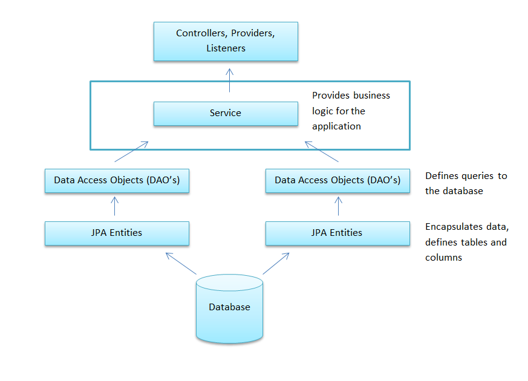

# KSM Faces Bookstore

## Description

This project describes a pseudo online bookstore that can be used to introduce developers to the core concepts required to develop enterprise web applications and integrations using CDI and JSF 2.3.  
It is also intended as an evaluation vehicle to gauge a developer’s understanding of those concepts and identify areas where additional training may be needed.

## Goals

- Ramp up developers on the core concepts required to develop enterprise web applications and integrations.
- Provide a consistent project and process that can be used to evaluate developers and their grasp of the core concepts.

## The Online Bookstore Project

### Overview

You will be building an online bookstore for KSM. The KSM Bookstore consists of the following functional components:

- A public front end allowing users to browse the store inventory.
- A simple checkout process allowing the user to purchase books.
- A secure backend used by administrators to manage inventory and process orders.

The requirements for these components are described below.

### Functional Requirements

- The default landing page should be a non-secure public landing page where the user can immediately begin searching the store inventory.
- Users should be able to search by Author, Book Title, or ISBN.
- Users should be able to sort by any of these attributes as well as price.
- Users should be able to select a book and add it to their cart.
- Users should be able to view the details of a book on a separate page and bookmark the page for viewing later.
- Users should be able to proceed to checkout and initiate the purchase of one or more books.
- Users should be able to cancel the order process and return to browsing.
- Users should be able to submit the order and receive confirmation of the submission.
- If a user provides an email address already in the system, they should be identified as a returning customer. It is acceptable to proactively prompt the user.
- As an administrator, I should be able to log in to the application and be taken to a dashboard that shows a list of submitted orders.
- As an administrator, I should be able to cancel an order and mark it as processed and complete.
- The dashboard should support filtering orders based on status.
- As an administrator, I should be able to manage the book inventory, including adding, editing, and deleting books and their authors.

### Data Model Requirements

The following are the core data model requirements.

#### Books

Attributes of a book must, at a minimum, include:

- Title  
- Author  
- ISBN  
- Retail Price  

#### Authors

Attributes of an author must, at a minimum, include:

- Author name  

#### Orders

An order should consist of:

- A unique order number.  
- The customer associated with the order.  
- The order total.  
- The order status:
  - Submitted – after the user submits the order.  
  - Cancelled – if the administrator cancels the order.  
  - Complete – when the administrator marks the order processed and complete.  
- The list of items (books) in the order.  

#### Customers

Customer information should be stored and must include:

- Customer first and last name  
- Email address  
- Billing address  
- Shipping address  

### Data Flow

A data flow diagram in the starter material illustrates how data moves between different parts of the application. Your implementation should follow the same general flow and layering when designing controllers, services, DAOs, and views.



### Security Requirements

- Only the administrative functionality requires authentication and authorization.  
- Security should be implemented using JAAS; it is acceptable to use Wildfly `.properties` files or the default security domain.  
- Returning users do not need to authenticate; providing an email address is sufficient for this pseudo application.  
- Secured pages and functionality must not be accessible without proper authentication and authorization.  

### User Interface Requirements

- User interfaces must be constructed using JSF 2.2 and the PrimeFaces component suite (the default Aristo theme is acceptable).  
- Facelet templates should be leveraged to avoid duplicating layout code across XHTML pages.  
- All messages and labels should be localized via `.properties` files.  

## Framework Requirements

A starter project is provided that includes the necessary dependencies. Additional frameworks should **not** be used. The core frameworks and tools are:

- Maven  
- CDI  
- JPA (Persistence/Hibernate)  
- JSF
- PrimeFaces  
- SLF4J  
- H2 in-memory database (via the `ExampleDS` data source)  
- Quarkus

## Development Guidelines

Developers are expected to follow the standard Web Developer guidelines, in particular:

- Project structure and packaging conventions.  
- Use of controllers, providers, DAOs, and other standard layers.  
- Proper exception handling strategy.  

Items that refer specifically to the KSM Tools Framework can be omitted for the purpose of this project; the focus here is on core CDI, JSF, JPA, and security concepts.

## The Starter Project

An original version of this project is stored in Git. To start working:

1. From the WebIDE, create a new branch from `main` that includes your name (for example, `yourname-bookstore`).
2. Clone your branch locally:

```bash
git clone https://github.com/ksmpartners/faces-bookstore
cd bookstore
git checkout -b yourname-bookstore origin/yourname-bookstore
```

3. Use `git branch --list` or `git status` to verify that you are on the correct branch.  
4. Import the project into your IDE as an existing Maven project.  
5. The project should run using `mvn quarkus:dev`

## Evaluation

### Overview

A key objective of this exercise is to provide a consistent way to evaluate developer proficiency and use the results to improve training.  
There is rarely a single “right” solution; instead, reviewers should look for evidence that the developer:

- Followed and made a good-faith effort to adhere to the developer guidelines.  
- Can explain and defend any deviations from those guidelines.  
- Produced code that would pass standard code review guidelines.  
- Designed a sensible JPA model:
  - Relationships between entities make sense.  
  - Entities are properly keyed.  
  - Data types are appropriate.  
- Properly partitioned logic instead of creating large monolithic classes.  
- Demonstrates solid understanding of CDI, JSF, and web security.  
- Properly secured the application.  
- Designed intuitive, user-friendly UI pages.  

Some criteria are subjective and require experienced reviewers to effectively evaluate the implementation.

### Code Review

After development is complete, schedule a code review where the developer walks through the implementation and explains their reasoning and design choices.  
This provides constructive feedback and helps leadership evaluate the developer’s understanding of the concepts; any gaps should be captured and fed back into training material.

## Local Development – Setup

### Add Users

TBD

### Create `BOOKSTORE` Schema in Datasource

TBD
